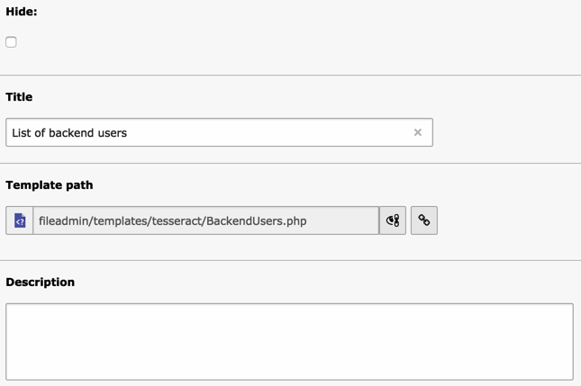

.. ==================================================
.. FOR YOUR INFORMATION
.. --------------------------------------------------
.. -*- coding: utf-8 -*- with BOM.

.. include:: ../Includes.txt

.. _introduction:

Introduction
============

.. _introduction-what-does-it-do:

What does it do?
----------------

The "phpdisplay" extension is a Data Consumer for the Tesseract framework. It is used to display and
format data given to him by the controller. PHP Display is well indicated when dealing with complex
layout by offering the flexibility of the PHP language. It is also targeting developers who prefer
to deal with PHP template. For small needs or for people who are not very familiar with PHP, the
"templatedisplay" extension would be probably more appropriate.

.. _introduction-screenshot:

Screenshot
----------

Here's a view of a PHP Display record in the TYPO3 BE:

.. _introduction-questions:

Questions?
----------

If you have any questions about this extension, you may want to refer to the Tesseract Project web
site (http://www.typo3-tesseract.com/) for support and tutorials. You may also ask questions in the
TYPO3 English mailing list (typo3.english).

.. _introduction-keeping-the-developer-happy:

Keeping the developer happy
---------------------------

If you like this extension, do not hesitate to make noise about it by
using the social bookmarks available in the extension's detailed view
on typo3.org:

http://typo3.org/extensions/repository/view/phpdisplay

You may also take a step back and reflect about the beauty of sharing.
Think about how much you are benefiting and how much yourself is
giving back to the community.
